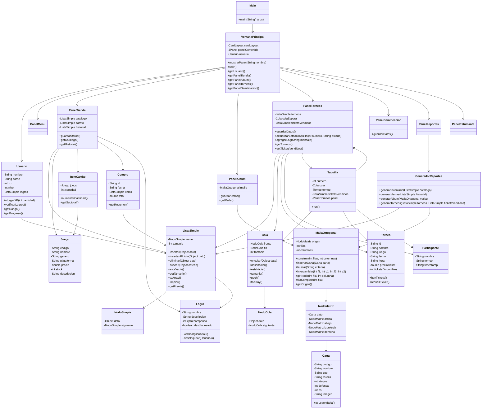

## Diagrama de Clases

```mermaid
classDiagram

class Main {
  +main(String[] args)
}

class VentanaPrincipal {
  -CardLayout cardLayout
  -JPanel panelContenido
  -Usuario usuario
  +mostrarPanel(String nombre)
  +salir()
  +getUsuario()
  +getPanelTienda()
  +getPanelAlbum()
  +getPanelTorneos()
  +getPanelGamificacion()
}

class PanelMenu
class PanelTienda {
  -ListaSimple catalogo
  -ListaSimple carrito
  -ListaSimple historial
  +guardarDatos()
  +getCatalogo()
  +getHistorial()
}
class PanelAlbum {
  -MallaOrtogonal malla
  +guardarDatos()
  +getMalla()
}
class PanelTorneos {
  -ListaSimple torneos
  -Cola colaEspera
  -ListaSimple ticketsVendidos
  +guardarDatos()
  +actualizarEstadoTaquilla(int numero, String estado)
  +agregarLog(String mensaje)
  +getTorneos()
  +getTicketsVendidos()
}
class PanelGamificacion {
  +guardarDatos()
}
class PanelReportes
class PanelEstudiante
class Taquilla {
  -int numero
  -Cola cola
  -Torneo torneo
  -ListaSimple ticketsVendidos
  -PanelTorneos panel
  +run()
}

class ListaSimple {
  -NodoSimple frente
  -int tamanio
  +insertar(Object dato)
  +insertarAlInicio(Object dato)
  +eliminar(Object dato)
  +buscar(Object criterio)
  +estaVacia()
  +getTamanio()
  +toArray()
  +limpiar()
  +getFrente()
}

class NodoSimple {
  -Object dato
  -NodoSimple siguiente
}

class Cola {
  -NodoCola frente
  -NodoCola fin
  -int tamanio
  +encolar(Object dato)
  +desencolar()
  +estaVacia()
  +tamanio()
  +peek()
  +toArray()
}

class NodoCola {
  -Object dato
  -NodoCola siguiente
}

class MallaOrtogonal {
  -NodoMatriz origen
  -int filas
  -int columnas
  +construir(int filas, int columnas)
  +insertarCarta(Carta carta)
  +buscar(String criterio)
  +intercambiar(int f1, int c1, int f2, int c2)
  +getNodo(int fila, int columna)
  +filaCompleta(int fila)
  +getOrigen()
}

class NodoMatriz {
  -Carta dato
  -NodoMatriz arriba
  -NodoMatriz abajo
  -NodoMatriz izquierda
  -NodoMatriz derecha
}

class Usuario {
  -String nombre
  -String carne
  -int xp
  -int nivel
  -ListaSimple logros
  +otorgarXP(int cantidad)
  +verificarLogros()
  +getRango()
  +getProgreso()
}

class Logro {
  -String nombre
  -String descripcion
  -int xpRecompensa
  -boolean desbloqueado
  +verificar(Usuario u)
  +desbloquear(Usuario u)
}

class Juego {
  -String codigo
  -String nombre
  -String genero
  -String plataforma
  -double precio
  -int stock
  -String descripcion
}

class ItemCarrito {
  -Juego juego
  -int cantidad
  +aumentarCantidad()
  +getSubtotal()
}

class Compra {
  -String id
  -String fecha
  -ListaSimple items
  -double total
  +getResumen()
}

class Carta {
  -String codigo
  -String nombre
  -String tipo
  -String rareza
  -int ataque
  -int defensa
  -int ps
  -String imagen
  +esLegendaria()
}

class Torneo {
  -String id
  -String nombre
  -String juego
  -String fecha
  -String hora
  -double precioTicket
  -int ticketsDisponibles
  +hayTickets()
  +reducirTicket()
}

class Participante {
  -String nombre
  -String torneo
  -String timestamp
}

class GeneradorReportes {
  +generarInventario(ListaSimple catalogo)
  +generarVentas(ListaSimple historial)
  +generarAlbum(MallaOrtogonal malla)
  +generarTorneos(ListaSimple torneos, ListaSimple ticketsVendidos)
}

Main --> VentanaPrincipal
VentanaPrincipal --> Usuario
VentanaPrincipal --> PanelMenu
VentanaPrincipal --> PanelTienda
VentanaPrincipal --> PanelAlbum
VentanaPrincipal --> PanelTorneos
VentanaPrincipal --> PanelGamificacion
VentanaPrincipal --> PanelReportes
VentanaPrincipal --> PanelEstudiante

PanelTienda --> ListaSimple
PanelTienda --> Juego
PanelTienda --> ItemCarrito
PanelTienda --> Compra
PanelTienda --> Logro

PanelAlbum --> MallaOrtogonal
MallaOrtogonal --> NodoMatriz
NodoMatriz --> Carta

PanelTorneos --> ListaSimple
PanelTorneos --> Cola
PanelTorneos --> Torneo
PanelTorneos --> Participante
PanelTorneos --> Taquilla

Taquilla --> Cola
Taquilla --> Torneo
Taquilla --> Participante
Taquilla --> PanelTorneos

ListaSimple --> NodoSimple
Cola --> NodoCola

Usuario --> ListaSimple
ListaSimple --> Logro

Compra --> ListaSimple
ItemCarrito --> Juego

PanelReportes --> GeneradorReportes
GeneradorReportes --> ListaSimple
GeneradorReportes --> MallaOrtogonal
```
