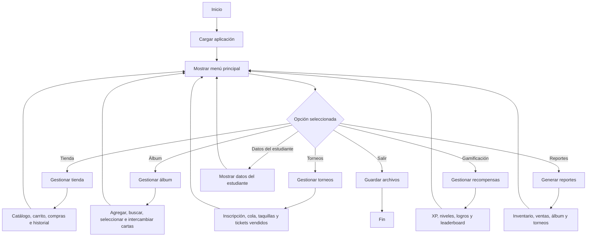
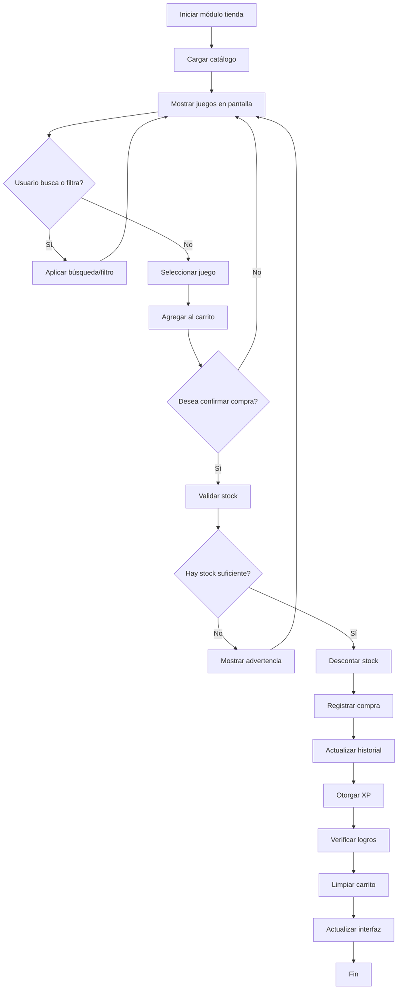
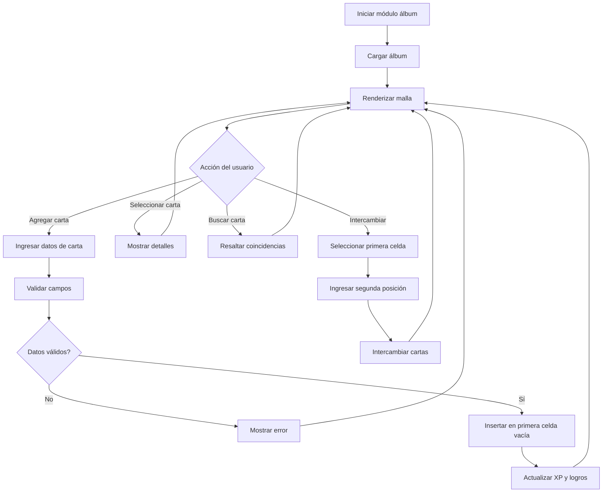
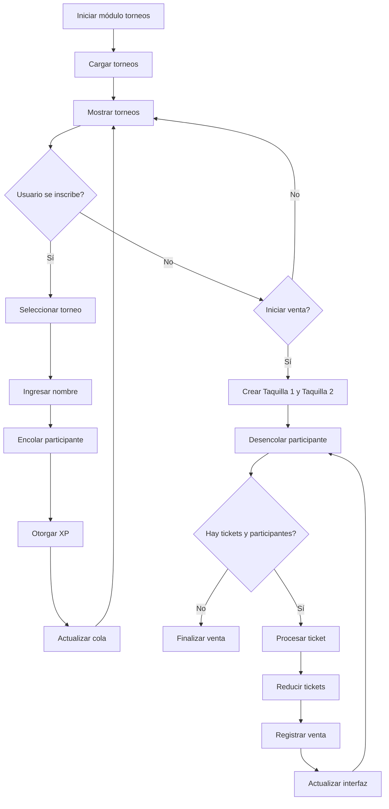
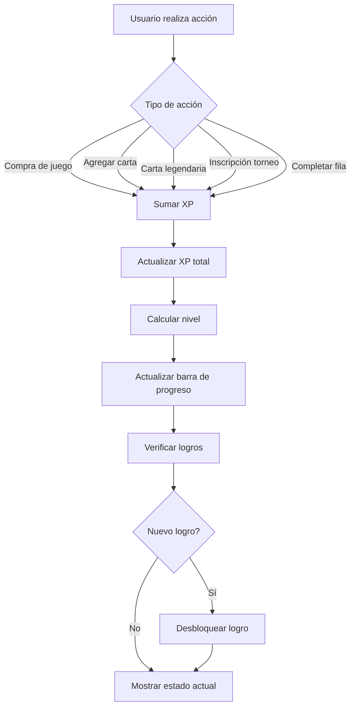

## Diagrama de Flujo General del Sistema

```mermaid
flowchart TD
    A[Inicio] --> B[Cargar aplicación]
    B --> C[Mostrar menú principal]
    C --> D{Opción seleccionada}

    D -->|Tienda| E[Gestionar tienda]
    E --> E1[Catálogo, carrito, compras e historial]
    E1 --> C

    D -->|Álbum| F[Gestionar álbum]
    F --> F1[Agregar, buscar, seleccionar e intercambiar cartas]
    F1 --> C

    D -->|Torneos| G[Gestionar torneos]
    G --> G1[Inscripción, cola, taquillas y tickets vendidos]
    G1 --> C

    D -->|Gamificación| H[Gestionar recompensas]
    H --> H1[XP, niveles, logros y leaderboard]
    H1 --> C

    D -->|Reportes| I[Generar reportes]
    I --> I1[Inventario, ventas, álbum y torneos]
    I1 --> C

    D -->|Datos del estudiante| J[Mostrar datos del estudiante]
    J --> C

    D -->|Salir| K[Guardar archivos]
    K --> L[Fin]
```

## Diagrama de Flujo - Tienda

```mermaid
flowchart TD
    A[Iniciar módulo tienda] --> B[Cargar catálogo]
    B --> C[Mostrar juegos en pantalla]
    C --> D{Usuario busca o filtra?}
    D -- Sí --> E[Aplicar búsqueda/filtro]
    E --> C
    D -- No --> F[Seleccionar juego]
    F --> G[Agregar al carrito]
    G --> H{Desea confirmar compra?}
    H -- No --> C
    H -- Sí --> I[Validar stock]
    I --> J{Hay stock suficiente?}
    J -- No --> K[Mostrar advertencia]
    K --> C
    J -- Sí --> L[Descontar stock]
    L --> M[Registrar compra]
    M --> N[Actualizar historial]
    N --> O[Otorgar XP]
    O --> P[Verificar logros]
    P --> Q[Limpiar carrito]
    Q --> R[Actualizar interfaz]
    R --> S[Fin]
```

## Diagrama de Flujo - Álbum

```mermaid
flowchart TD
    A[Iniciar módulo álbum] --> B[Cargar álbum]
    B --> C[Renderizar malla]
    C --> D{Acción del usuario}
    D -- Agregar carta --> E[Ingresar datos de carta]
    E --> F[Validar campos]
    F --> G{Datos válidos?}
    G -- No --> H[Mostrar error]
    H --> C
    G -- Sí --> I[Insertar en primera celda vacía]
    I --> J[Actualizar XP y logros]
    J --> C
    D -- Seleccionar carta --> K[Mostrar detalles]
    K --> C
    D -- Buscar carta --> L[Resaltar coincidencias]
    L --> C
    D -- Intercambiar --> M[Seleccionar primera celda]
    M --> N[Ingresar segunda posición]
    N --> O[Intercambiar cartas]
    O --> C
```

## Diagrama de Flujo - Torneos

```mermaid
flowchart TD
    A[Iniciar módulo torneos] --> B[Cargar torneos]
    B --> C[Mostrar torneos]
    C --> D{Usuario se inscribe?}
    D -- Sí --> E[Seleccionar torneo]
    E --> F[Ingresar nombre]
    F --> G[Encolar participante]
    G --> H[Otorgar XP]
    H --> I[Actualizar cola]
    I --> C
    D -- No --> J{Iniciar venta?}
    J -- No --> C
    J -- Sí --> K[Crear Taquilla 1 y Taquilla 2]
    K --> L[Desencolar participante]
    L --> M{Hay tickets y participantes?}
    M -- No --> N[Finalizar venta]
    M -- Sí --> O[Procesar ticket]
    O --> P[Reducir tickets]
    P --> Q[Registrar venta]
    Q --> R[Actualizar interfaz]
    R --> L
```

## Diagrama de Flujo - Gamificación

```mermaid
flowchart TD
    A[Usuario realiza acción] --> B{Tipo de acción}
    B -- Compra de juego --> C[Sumar XP]
    B -- Agregar carta --> C
    B -- Carta legendaria --> C
    B -- Inscripción torneo --> C
    B -- Completar fila --> C
    C --> D[Actualizar XP total]
    D --> E[Calcular nivel]
    E --> F[Actualizar barra de progreso]
    F --> G[Verificar logros]
    G --> H{Nuevo logro?}
    H -- Sí --> I[Desbloquear logro]
    H -- No --> J[Mostrar estado actual]
    I --> J
```

