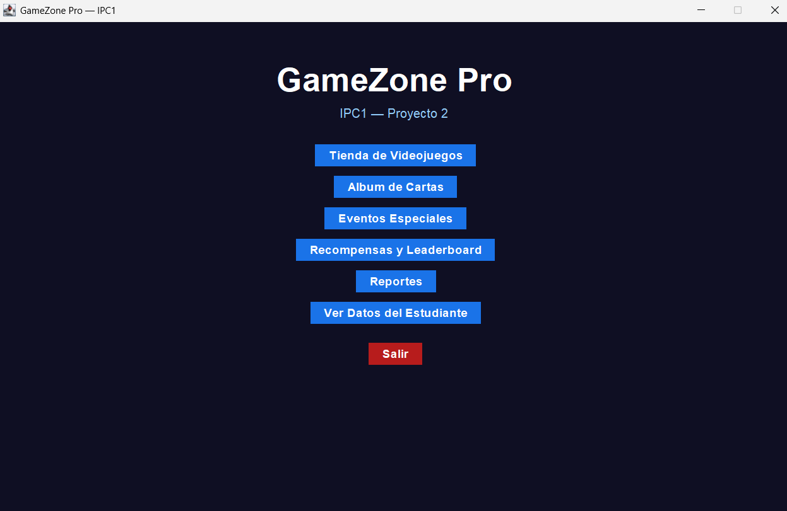
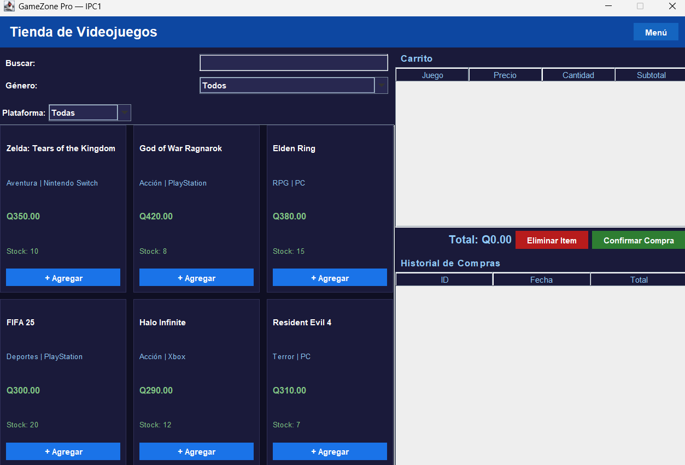
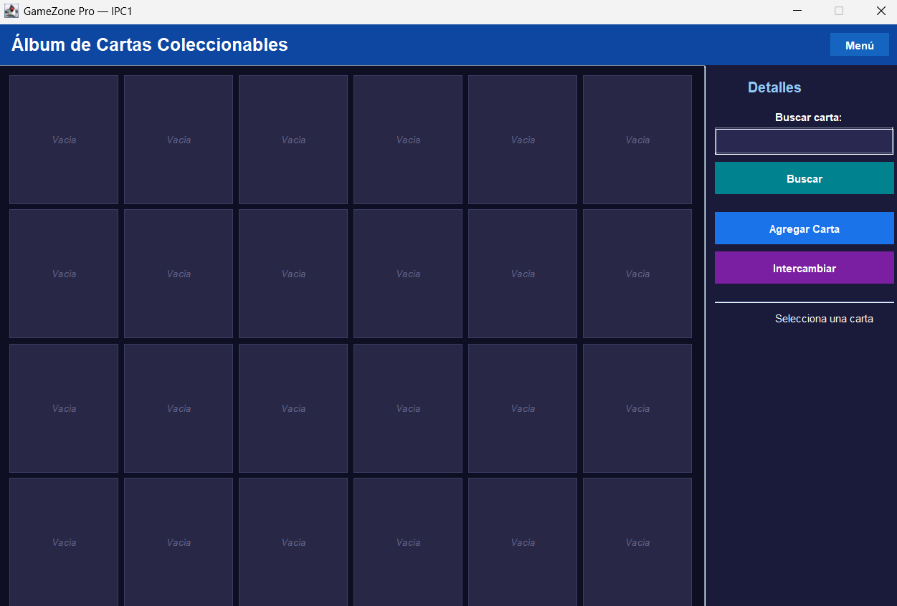
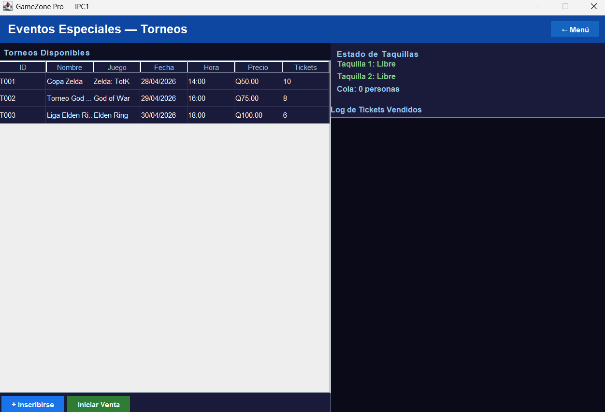

# Manual Técnico
# GameZone Pro

## 1. Introducción

GameZone Pro es una aplicación de escritorio desarrollada en Java Swing que integra varios módulos funcionales en una sola plataforma. Su implementación se basa en estructuras de datos construidas manualmente, persistencia en archivos, programación orientada a objetos y concurrencia.

## 2. Objetivo técnico

Desarrollar un sistema que permita aplicar conceptos de:

- Programación orientada a objetos
- Estructuras de datos dinámicas
- Interfaz gráfica con Swing
- Persistencia en archivos
- Programación concurrente
- Generación de reportes HTML

## 3. Organización del proyecto

El sistema se divide en paquetes según su responsabilidad:

- `estructuras`
- `modelos`
- `modulos`
- `reportes`
- `gamezonepro`

## 4. Clase principal

La clase principal del sistema es:

`gamezonepro.Main`

Su función es iniciar la aplicación mediante `SwingUtilities.invokeLater()` y mostrar la ventana principal.

## 5. Descripción de paquetes

### 5.1 Paquete `estructuras`

#### `NodoSimple`
Representa un nodo para la lista enlazada simple.

#### `ListaSimple`
Implementación propia de lista simple.

Se utiliza en:
- catálogo
- carrito
- historial
- logros
- torneos
- tickets vendidos

#### `NodoCola`
Nodo utilizado por la cola del módulo de torneos.

#### `Cola`
Implementación propia de una cola FIFO.

Operaciones:
- `encolar()`
- `desencolar()`
- `estaVacia()`
- `tamanio()`
- `peek()`

#### `NodoMatriz`
Nodo de la malla ortogonal con enlaces:
- arriba
- abajo
- izquierda
- derecha

#### `MallaOrtogonal`
Estructura que modela el álbum de cartas mediante nodos enlazados.

Operaciones:
- `construir()`
- `insertarCarta()`
- `buscar()`
- `intercambiar()`
- `getNodo()`
- `filaCompleta()`

## 6. Descripción de modelos

### `Juego`
Modela un videojuego dentro del catálogo.

### `ItemCarrito`
Modela un ítem dentro del carrito de compras.

### `Compra`
Representa una compra confirmada con fecha, identificador e importe total.

### `Carta`
Representa una carta coleccionable con sus atributos.

### `Torneo`
Representa un torneo disponible para inscripción y venta de tickets.

### `Participante`
Representa una persona inscrita a un torneo.

### `Usuario`
Representa al usuario principal del sistema, el cual acumula XP, niveles y logros.

### `Logro`
Representa un objetivo desbloqueable dentro de la gamificación.

## 7. Descripción de módulos

### `VentanaPrincipal`
Clase principal de la interfaz. Administra la navegación con `CardLayout`.

### `PanelMenu`
Pantalla de inicio con acceso a los demás módulos.

### `PanelTienda`
Módulo encargado de:
- carga del catálogo
- filtros y búsqueda
- carrito
- historial
- compras
- persistencia

### `PanelAlbum`
Módulo encargado de:
- renderizar la malla
- agregar cartas
- mostrar detalles
- buscar cartas
- intercambiar posiciones

### `PanelTorneos`
Módulo encargado de:
- mostrar torneos
- encolar participantes
- iniciar venta con hilos
- mostrar estados de taquillas
- persistir tickets vendidos

### `Taquilla`
Clase `Thread` que procesa concurrentemente la cola de participantes.

### `PanelGamificacion`
Módulo encargado de mostrar:
- nombre del usuario
- XP
- nivel
- logros
- leaderboard

### `PanelReportes`
Módulo que invoca al generador de reportes HTML.

### `PanelEstudiante`
Módulo que presenta la información del estudiante creador del proyecto.

## 8. Persistencia

El sistema utiliza archivos de texto para almacenar y recuperar información:

- `catalogo.txt`
- `historial.txt`
- `album.txt`
- `torneos.txt`
- `tickets_vendidos.txt`

La lectura se realiza al iniciar ciertos módulos y la escritura al cerrar la aplicación.

## 9. Concurrencia

La concurrencia se implementa en el módulo de torneos.

Aspectos relevantes:
- Existen al menos dos hilos de taquilla.
- Ambos consumen elementos de una cola compartida.
- El método `desencolar()` se ejecuta de forma sincronizada.
- La GUI se actualiza mediante `SwingUtilities.invokeLater()`.

## 10. Reportes

La clase `GeneradorReportes` crea reportes HTML con CSS embebido.

Tipos:
- Inventario
- Ventas
- Álbum
- Torneos

## 11. Validaciones implementadas

- Campos vacíos
- Conversión de números
- Stock insuficiente
- Selección obligatoria de filas
- Posiciones fuera de rango en álbum
- Existencia de archivos

## 12. Capturas técnicas

### Ventana principal

  

### Tienda

  

### Álbum

  

### Torneos

  

## 13. Conclusión técnica

El proyecto integra estructuras de datos propias, persistencia, interfaz gráfica y concurrencia en una aplicación completa, organizada por módulos y alineada con los objetivos del curso.
